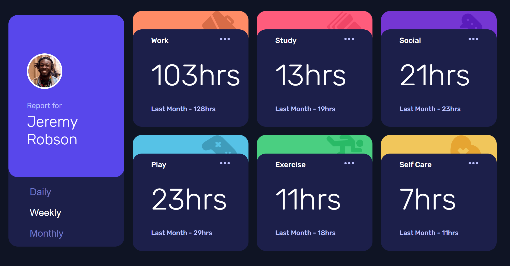

# Frontend Mentor - Time tracking dashboard solution

This is a solution to the [Time tracking dashboard challenge on Frontend Mentor](https://www.frontendmentor.io/challenges/time-tracking-dashboard-UIQ7167Jw). Frontend Mentor challenges help you improve your coding skills by building realistic projects. 

## Table of contents

- [Overview](#overview)
  - [The challenge](#the-challenge)
  - [Screenshot](#screenshot)
  - [Links](#links)
- [My process](#my-process)
  - [Built with](#built-with)
  - [What I learned](#what-i-learned)
  - [Continued development](#continued-development)
  - [Useful resources](#useful-resources)
- [Author](#author)

**Note: Delete this note and update the table of contents based on what sections you keep.**

## Overview

### The challenge

Users should be able to:

- View the optimal layout for the site depending on their device's screen size
- See hover states for all interactive elements on the page
- Switch between viewing Daily, Weekly, and Monthly stats

### Screenshot




### Links

- Solution URL: [Add solution URL here](Frontend Mentor)
- Live Site URL: [Netlify](https://celadon-kelpie-049ef6.netlify.app/)

## My process

As always I start with a CSS wireframe aiming for pixel-perfect accuracy, then add Javascript functionality.

### Built with

- Semantic HTML5 markup
- CSS custom properties
- Async Javascript
- CSS Grid
- Mobile-first workflow

### What I learned

More practice with CSS grid! This was also the first time I have imported data from a JSON file rather than a JS file, so it was fun to research how to do so properly using async function fetch.

```js
async function retrieveData(){
    dataArr = await fetch('./data.json')
    .then(response => {
    return response.json();
})
generateAppHtml(dataArr);
};
```
### Continued development

Further training with Javascript and CSS Grid.

### Useful resources

- [Destructuring Nested Objects in Javascript](https://medium.com/@pyrolistical/destructuring-nested-objects-9dabdd01a3b8) - A lifesaver for object destructuring in this project!
- [Creating Inverted Borders in CSS](https://itnext.io/how-to-make-a-fancy-inverted-border-radius-in-css-5db048a53f95) - This project would have been impossible without this amazing tutorial from Jeroen Knol.

## Author

- Website - [Val](https://github.com/valryanb)
- Frontend Mentor - [@valryanb](https://www.frontendmentor.io/profile/valryanb)
